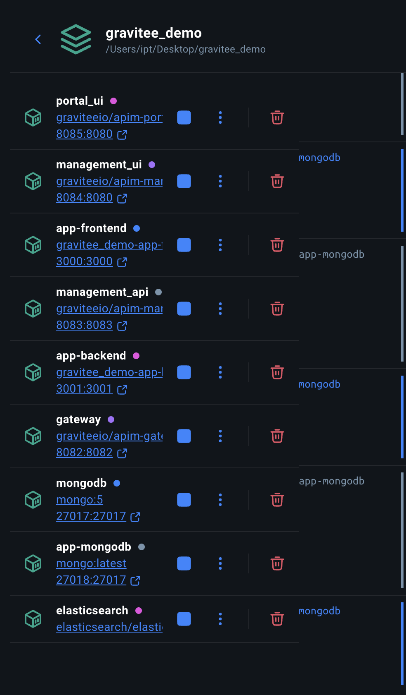
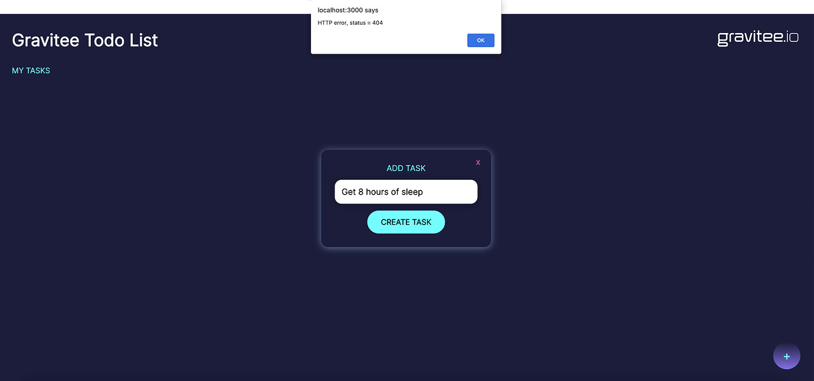
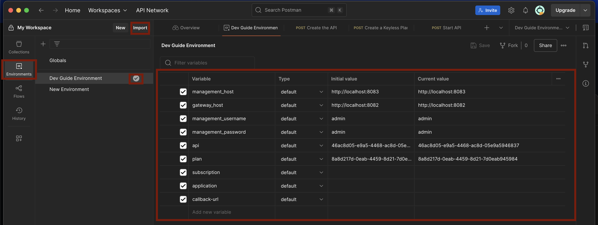

# API Gateway Demo
## Introduction

What you will learn:

* What is an API gateway. Why is it required and what are its tasks.
* Connect the frontend of a simple ToDo app with a backend by exposing the API using Gravitee, an open-source API management platform that provides tools to secure, publish, manage, and monitor APIs.
* What are plans and flows (aka policies) and how to add them to the API gateway using yaml files or through the Gravitee UI.
* Future: Adding AM (Access Management) to the API gateway, more interesting policy examples

What you need:

* Docker
* Postman Desktop App (API development and testing tool, allows us to easily make requests to the gateway and see the corresponding responses.)

If you are completely new to certain basic topics, I recommend taking a look at: [Basics](https://community.gravitee.io/t/part-1-the-essentials/1458)
It includes small introductions to APIs in general, the network stack and its protocols, specifications such as OpenAPI, etc.

You can find a more in-depth introduction into API gateways here: https://community.gravitee.io/t/part-2-gravitee-key-concepts-and-core-offerings/1459
This introduction uses Gravitee as an example, but many of the key concepts apply generally regardless of the used API management tool. I recommend having a lookt at:
* [Overview](https://community.gravitee.io/t/part-2-gravitee-key-concepts-and-core-offerings/1459)
* [API Gateway: Policies and Plugins](https://community.gravitee.io/t/part-2-gravitee-key-concepts-and-core-offerings/1459#api-gateway-policies-and-plugins-5)

## DEMO
The following tutorial is based on: [Gravitee Demo](https://community.gravitee.io/t/part-3-getting-started/1460). You can also follow the steps there. However, the tutorial uses Thunder Client which requires a license in order to follow the steps. We use Postman instead.

## Docker
First you need to run the containerized application:
```
docker compose up -d
```

The Docker Desktop app will now show you all of the containers running in the container.


If you are interested in how these containers are connected, you can have a look at the [docker-compose.yaml](./docker-compose.yml)


## ToDo App

Let's start the ToDo Application. In the Docker Desktop App click on the link under the app-frontend container (gravitee_demo-app-3000:3000). This will open the app in your web browser. Try to add a new item to the list by clicking on the "+" sign at the bottom right corner. You should get a 404 error message.


So what happened here? The application is tied to an API that comunicates with a database on the backend. When you cliked the "+"-button, a HTTP POST was sent to the gateway. We havent setup the gateway yet, so it didn't know how to proxy this request and responded with a 404.
Let's fix that.

## Management API
There are two options to create an API and deploy it on a Gravitee gateway. You can either use the management API or the management console. Let's start with the mangement API. For this you will need to start the Postman Desktop App. 

### Postman
Postman is a neat tool to create and deploy an API on your gateway. It can import an environment and collections of API calls from a .json file.

Let's start by creating an environment in Postman. An environment allows you to specify certain variables that you can reuse in your collections, such as the address of the gateway host etc.. For this, click to the "Environments" Tab on the left of the Postman App, then click on "Import" and select the file in `postman-collections/getting-started/postman-environment.json`. Make yourself familiar with the variables you just created for this environment.




